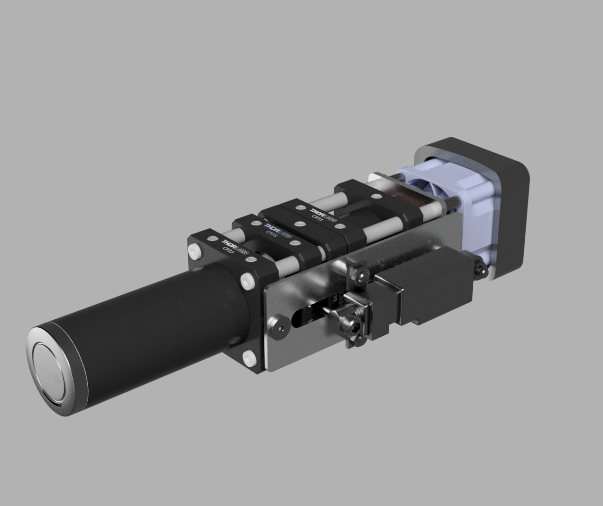
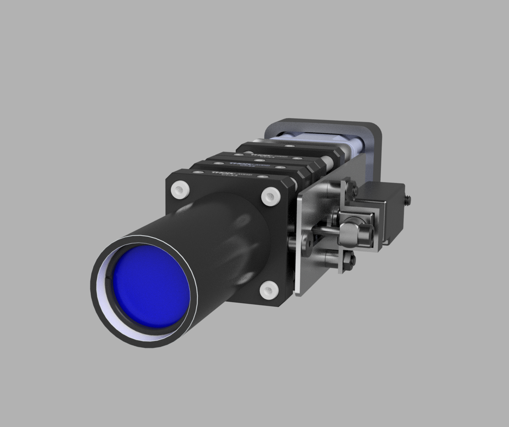
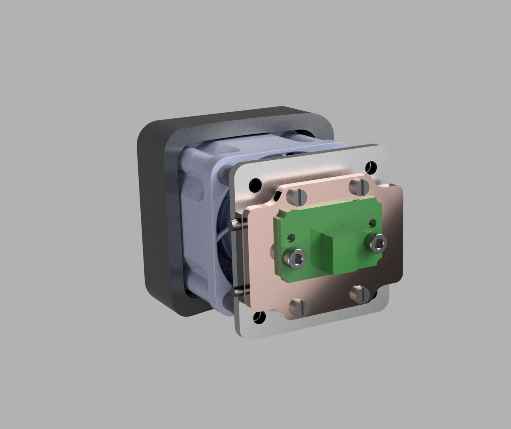

# Custom Laser Assembly V2

Welcome to the repository for my custom laser assembly V2, which is a more compact and tunable version of my V1 laser assembly. This particular project is designed for the NUBB23 laser diode array (22W). Some major differences compared to the first version are an integrated auto-focusing system, a more compact and sturdy construction, a cheaper and more manufacturable heatsink assembly, and better focusing ability. 

This is currently still a work in progress, and I plan to design a new laser driver with an integrated MCU, TEC driver, servo driver, and supercapacitors (for pulsed operation). 

---

## 📸 Project Gallery

Here are some renders of the custom PCB and the mechanical assemblies:

### Optical Assembly Renders

### Laser Assembly Render

### Optical Assembly Real Image (No Servo)

---

## ✨ Features

* **Active Cooling:** With the custom heatsink, mount, fan, and TEC assembled, you should have more than enough cooling for 22W lasers. 
* **Optical Integration:** I am using the Thorlabs 30mm cage system with lenses to better focus the beam. Now, the entire cage/laser system is one piece, which means this laser assembly can be integrated into a larger system. Improvements can most likely be made to my setup, as lens system design is not my specialty.
* **Integrated Focusing:** With the servo connected, you can now fine-tune the laser focal point. Further electronic integration will be implemented for digital control, possibly allowing auto-focusing with a separate range-finding component.

---

## 📂 Repository Structure

* `/Lens_Assy` - Contains the CAD files (STEP) for the custom mechanical mounts, plastic enclosure, and the BOM.
* `/Media` - Contains various images and videos of the laser assembly.

---

## 🛠️ Hardware Specifications

### Mechanical Mount
* **Cage Compatibility:** Thorlabs 30mm Cage System
* **Cooling Method:** Active (Heatsink + Fan + TEC)
* **Linear Servo:** Actuonix L12 10mm
* **Material:** Copper laser mount, aluminum heatsink, 3D printed plastic

---

## 🚀 Assembly Instructions

1. **Optics Assy:** More detailed instructions will be available at a later point; refer to the provided STEP assembly file in the interim.

---

## 🥽 Operating Instructions

1. **Safety:** More detailed instructions will be available when the electronics are designed, tested, and published. Always wear proper safety goggles when working with lasers. 

---

## ⚠️ Safety Warning

**WARNING: LASER RADIATION**

This project involves the operation of lasers that can cause immediate and permanent damage to eyesight, skin, and materials. 
* Always wear appropriate Laser Safety Goggles rated for the specific wavelength and optical density (OD) of your laser diode.
* Never look directly into the beam or any specular reflections.
* This hardware is provided "as-is" for educational and hobbyist purposes. You are solely responsible for ensuring you operate your laser equipment safely and in accordance with local regulations.

---

## 📝 License

This project is licensed under the [MIT License](License.txt) - see the LICENSE file for details.